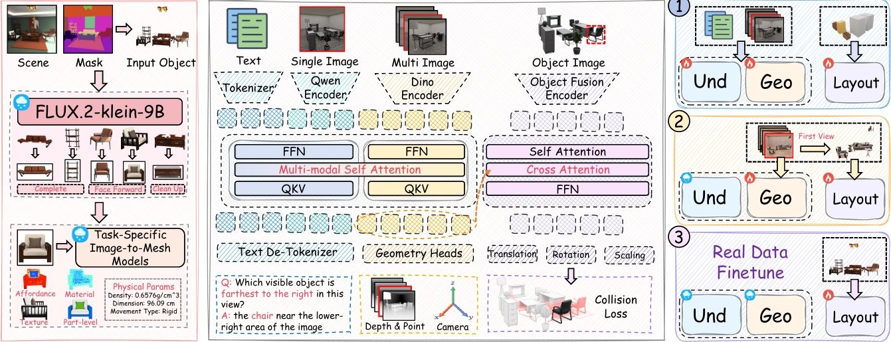
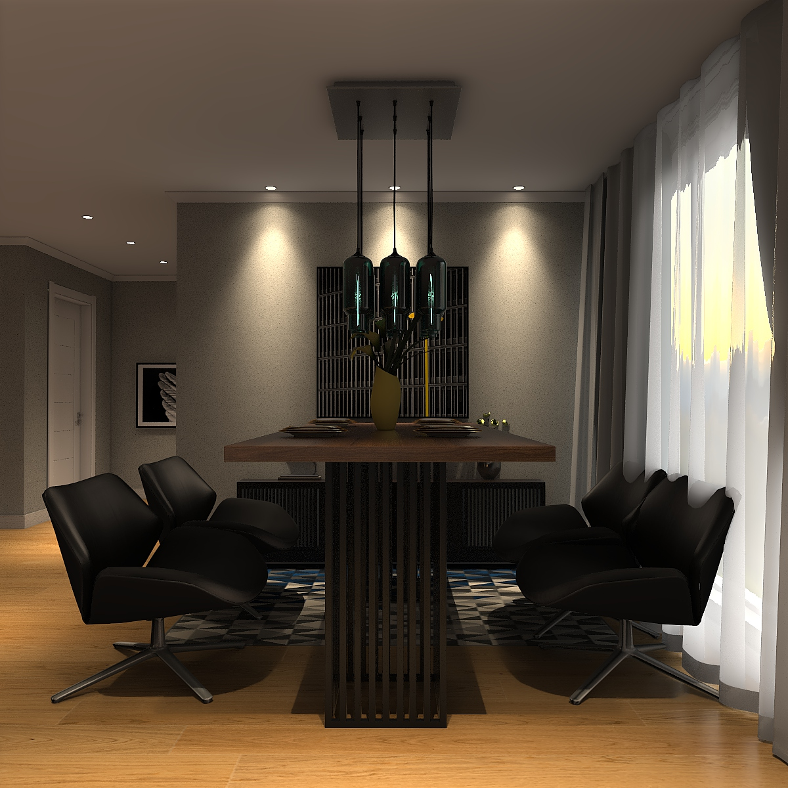
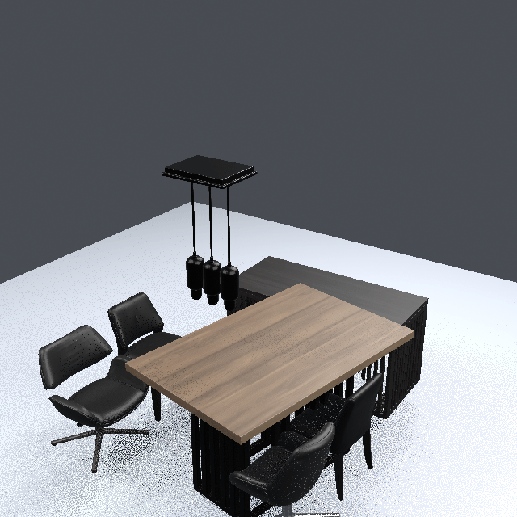
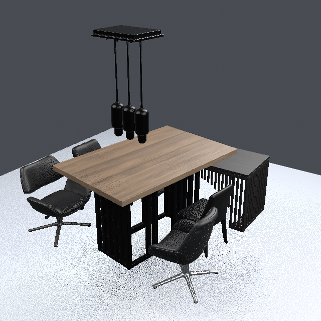
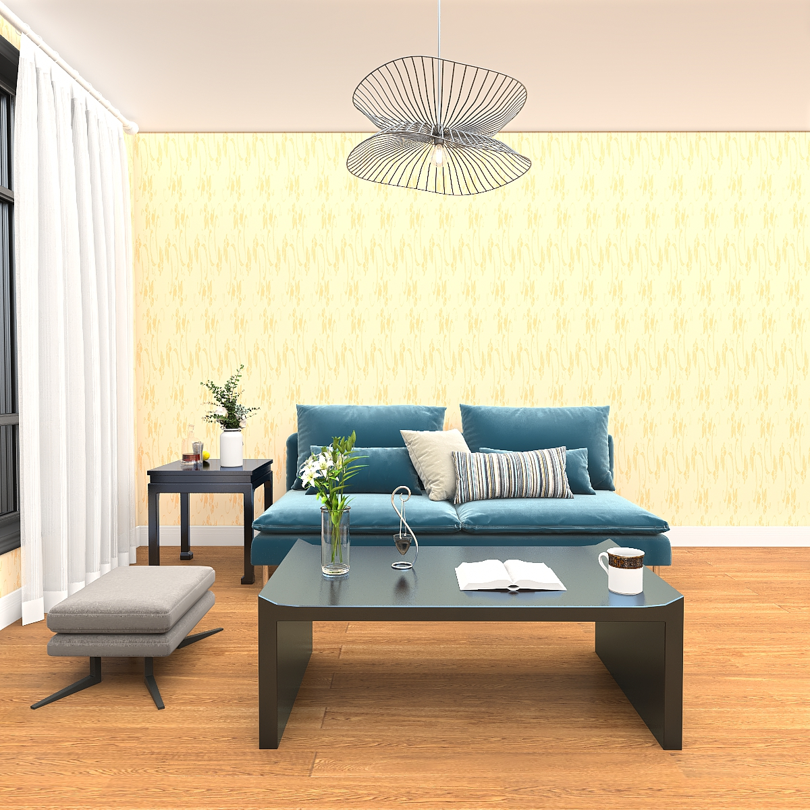
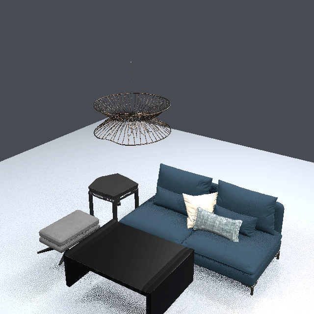
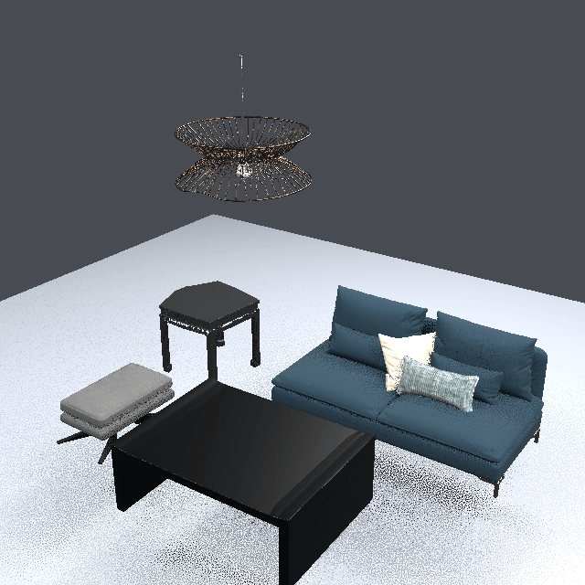
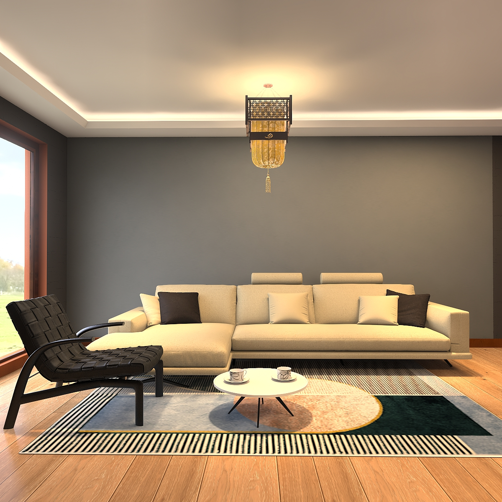
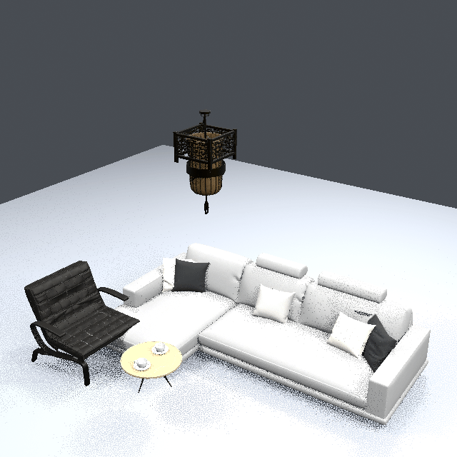
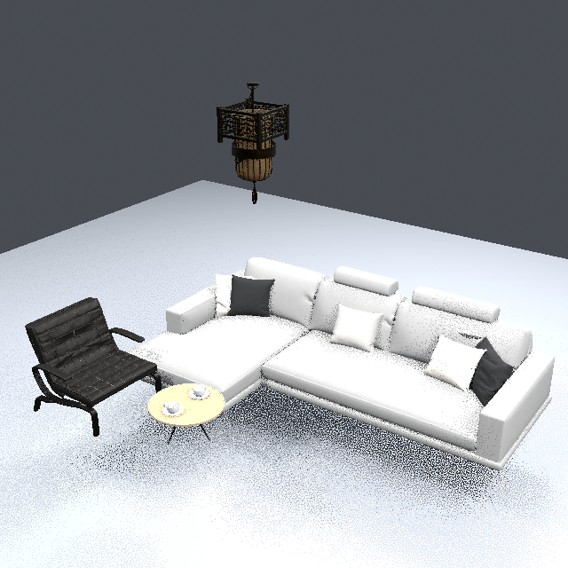

# Fysiverse-3D-Vision

This repository provides inference code and model files for reconstructing an
editable indoor 3D scene from a single RGB image. The pipeline accepts supplied
instance masks or creates them automatically, obtains a 3D asset for each
object, estimates its translation, rotation, and scale, and assembles the
assets into a GLB scene.

The released **Fysiverse-3D-Vision** model estimates object placement from the
scene image, object mask, and geometric conditions. Object-asset generation is
handled by a separate backend.

[📄 Paper](#paper) | 🏗️ [Architecture](#architecture) | 🖼️ [Results](#results) |
⚙️ [Install](#install) | 🤖 [Models](#models) | ▶️ [Inference](#inference) |
📚 [Documentation](#documentation) | ⚖️ [License](#license)

## Architecture

The pipeline uses separate stages for object assets and scene placement. An
object-generation backend supplies a mesh and appearance for each selected
object. The Fysiverse-3D-Vision model takes the scene RGB image, target mask,
and geometric inputs, and predicts translation, rotation, and scale in a common
scene coordinate frame. These transforms are applied when the assets are
assembled into a GLB scene. Post-refinement uses the calibrated camera
parameters of the input image to adjust image-space alignment, ground contact,
and separation between objects.



For implementation details of the released inference pipeline, see the
[project documentation](#documentation). This release contains the runtime
code and public model configuration needed for inference.

```text
RGB image
  -> user mask or automatic segmentation
  -> object completion
  -> per-object 3D assets
  -> Fysiverse-3D-Vision (translation / rotation / scale)
  -> scene.glb assembly
  -> optional visual post-refinement
```

## Results

The examples below pair each input image with the scene assembled from the
model-predicted transforms, before and after the optional post-refinement
step.

<table>
  <thead>
    <tr>
      <th>Input</th>
      <th>Before refinement</th>
      <th>After refinement</th>
    </tr>
  </thead>
  <tbody>
    <tr>
      <td align="center" valign="top"></td>
      <td align="center" valign="top"></td>
      <td align="center" valign="top"></td>
    </tr>
    <tr>
      <td align="center" valign="top"></td>
      <td align="center" valign="top"></td>
      <td align="center" valign="top"></td>
    </tr>
    <tr>
      <td align="center" valign="top"></td>
      <td align="center" valign="top"></td>
      <td align="center" valign="top"></td>
    </tr>
  </tbody>
</table>

## Install

The setup uses five isolated Conda environments because the backends require
different Python, PyTorch, and CUDA extension versions. The installer creates
new environments only; it does not update, overwrite, repair, or delete
existing environments.

Create the environments, fetch the pinned source checkouts, and install their
dependencies:

```bash
bash scripts/bootstrap_envs.sh
```

Install one role only when needed:

```bash
bash scripts/bootstrap_envs.sh --only layout
bash scripts/bootstrap_envs.sh --only trellis
bash scripts/bootstrap_envs.sh --only refine
```

The environment roles are `fysiverse-mask`, `fysiverse-flux`,
`fysiverse-trellis2`, `fysiverse-layout`, and `fysiverse-refine`. A provided
mask does not require the mask environment or automatic segmentation model.
For version details, manual installation, CUDA extensions, and host checks,
see [docs/environment.md](docs/environment.md).

## Models

Model weights are not stored in Git. The downloader writes them below `models/`,
checks required files and available disk space, and fetches the pinned source
dependencies for the selected model group. For source links, local destinations,
authentication, fallback providers, and manual download steps, see
[docs/models.md](docs/models.md).

Download the complete set:

```bash
bash scripts/download_all_models.sh
```

Download only the Fysiverse-3D-Vision package and its runtime dependencies:

```bash
bash scripts/download_model.sh layout
```

The Fysiverse-3D-Vision package is written to `models/layout`. Other runtime groups are
placed under `models/` using the paths in `configs/models.json`. Public models
download without credentials; gated providers require accepting their terms
and logging in with an access token. Network failures can use the configured
ModelScope fallback:

```bash
bash scripts/download_all_models.sh --model-source auto
```

</details>

## Inference

The supported entry point is `scripts/run_inference.sh`.

With a user-provided mask:

```bash
bash scripts/run_inference.sh \
  --image input/room.png \
  --mask input/mask.png \
  --camera input/camera.json \
  --output result/room
```

Without `--mask`, the pipeline uses Grounded-SAM2 to create instance masks:

```bash
bash scripts/run_inference.sh \
  --image input/room.png \
  --camera input/camera.json \
  --output result/room
```

Common options are `--image`, `--mask`, `--camera`, `--output`, `--gpu`,
`--seed`, `--model-root`, `--source-root`, `--layout-model`, and the role
environment overrides (`--mask-env`, `--flux-env`, `--trellis-env`,
`--layout-env`, and `--refine-env`). Run `--help` for the complete list:

```bash
bash scripts/run_inference.sh --help
```

The calibrated camera is required for refinement. Post-refinement is **enabled
by default** and writes the original `scene.glb`, a `scene_refined.glb`, and a
`post_refine/` report directory. It performs silhouette-based pose adjustment,
ground snapping, and convex-hull separation. To disable it:

```bash
bash scripts/run_inference.sh \
  --image input/room.png --mask input/mask.png \
  --output result/room --skip-refine
```

Skipping refinement avoids Blender, nvdiffrast, and the refine environment; no
refinement metrics or refined GLB are produced. Input masks, camera schema,
manifests, output files, and coordinate conventions are documented in
[docs/input-output-protocol.md](docs/input-output-protocol.md).

## Documentation

- [Environment and CUDA extension installation](docs/environment.md)
- [Model sources and download layout](docs/models.md)
- [Third-party source repositories and checkout paths](docs/third-party-sources.md)
- [Input/output protocol and manifest](docs/input-output-protocol.md)
- [Fysiverse-3D-Vision model package format](docs/layout-model-format.md)

## Paper

Paper and supplementary material: **Coming soon**.

## License

The source code is released under the [Apache License 2.0](LICENSE). See
[NOTICE](NOTICE) for attribution and component boundaries. Downloaded model
weights and third-party source repositories retain their own licenses and
terms; review them before redistribution or commercial use.
